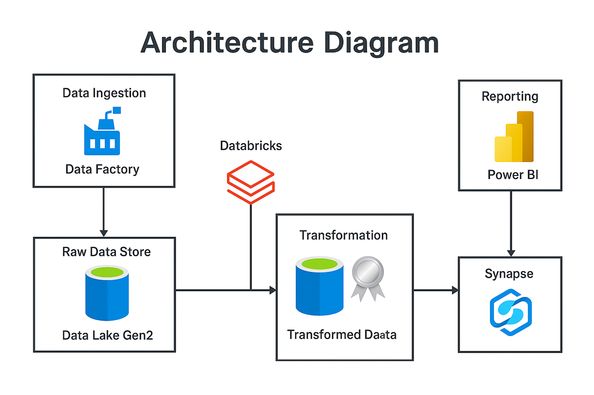
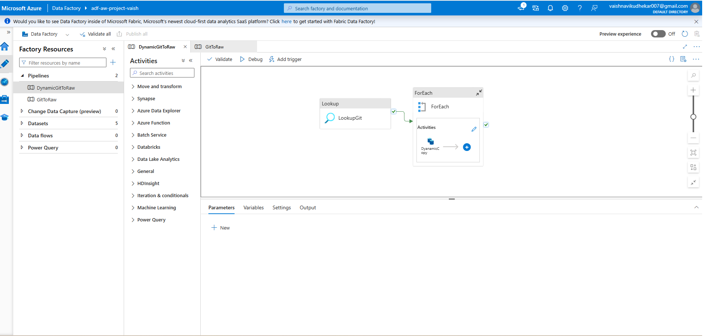
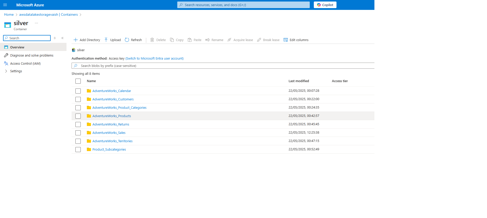
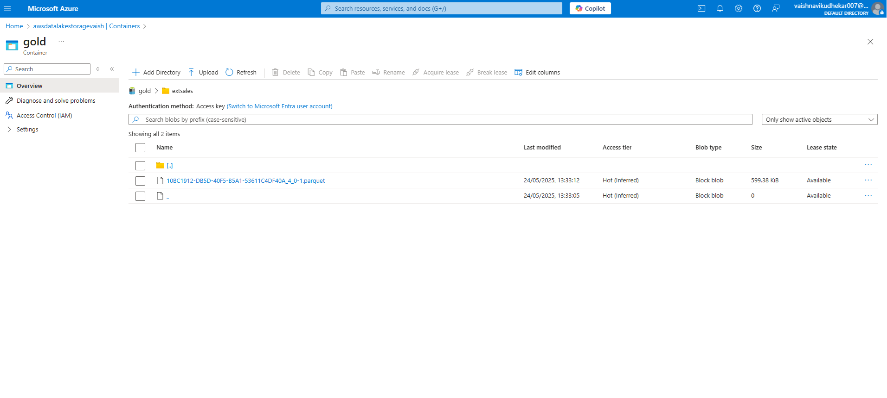

# 🚀 Azure Data Engineering End-to-End Project

## 🧭 Overview

This project demonstrates a real-world data pipeline built entirely using Azure tools:

- **Data Ingestion**: Azure Data Factory  
- **Storage**: Azure Data Lake Gen2  
- **Transformation**: Azure Databricks (PySpark)  
- **Serving**: Azure Synapse Analytics  
- **Visualization**: Power BI  

---

## 🗺️ Architecture Diagram

---

## 🔄 End-to-End Workflow

1. **Data Ingestion**  
   - Azure Data Factory ingests data from HTTP sources  
   - Raw data lands in the **bronze** zone of Azure Data Lake Gen2

2. **Data Transformation**  
   - Databricks notebooks clean, enrich, and transform data from bronze to **silver**
   - Aggregated and analytics-ready data written to the **gold** layer

3. **Data Serving**  
   - Synapse Analytics reads the gold layer for analysis using SQL scripts

4. **Data Visualization**  
   - Power BI is connected to Synapse for building reports and dashboards

---

## 💾 Storage Layer Structure

| Layer  | Description                        |
|--------|------------------------------------|
| Bronze | Raw ingested files (no changes)   |
| Silver | Cleaned and structured data       |
| Gold   | Aggregated and business-ready     |

---

## 📒 Notebooks and Scripts

| Component       | File |
|-----------------|------|
| Silver Layer Notebook | [silver_layer.ipynb](./assets/silver_layer.ipynb) |
| Gold Layer SQL Views  | [Create Views gold.sql](./assets/Create%20Views%20gold.sql) |

---

## 🖼️ Screenshots

| Component           | Preview |
|---------------------|---------|
| **ADF Pipeline**    |  |
| **Bronze Layer**    |  |
| **Silver Layer**    |  |
| **Gold Layer**      |  |

---

## 💼 Why This Project Matters

This project is not just a demo — it reflects my **hands-on experience designing, deploying, and operating real-world data pipelines** using modern Azure tools. I implemented everything from ingestion to transformation and reporting myself.

### Key Responsibilities I Handled:
- Provisioned and configured Azure services (ADF, Storage, Databricks, Synapse)
- Designed a multi-layer **lakehouse architecture** (`bronze`, `silver`, `gold`)
- Built end-to-end ingestion and transformation pipelines using **PySpark**
- Set up secure access using **OAuth** and **service principal** authentication
- Registered transformed data for querying via **Synapse Analytics**
- Created data views and ran analytical SQL for reporting
- Visualized outcomes with **Power BI**, simulating real stakeholder dashboards

This project proves I can:
- Work independently across the Azure data stack
- Build scalable, production-ready solutions
- Automate data processing with a focus on clarity, governance, and efficiency

---

## 🧪 Tech Stack in Action

| Tool                  | My Implementation Example                                                  |
|-----------------------|----------------------------------------------------------------------------|
| **Azure Data Factory** | Ingested JSON via REST API into bronze layer                              |
| **Azure Data Lake Gen2** | Structured as bronze/silver/gold for scalable data management           |
| **Databricks (PySpark)** | Wrote custom transformation logic, used OAuth2 for secure data access   |
| **Synapse Analytics** | Registered gold data, created views and analytical queries                 |
| **Power BI**          | Connected Synapse to Power BI to build final report                        |
| **GitHub**            | Used for version control and documentation                                 |

---

## 📎 How to Reuse This Project

1. Clone this repo  
2. Update linked services in ADF to your sources  
3. Recreate storage containers: `bronze/`, `silver/`, `gold/`  
4. Upload notebooks to Databricks  
5. Update Power BI connections with your Synapse endpoint

---

> Feel free to fork this repo and adapt it to your own data sources or business use case!
